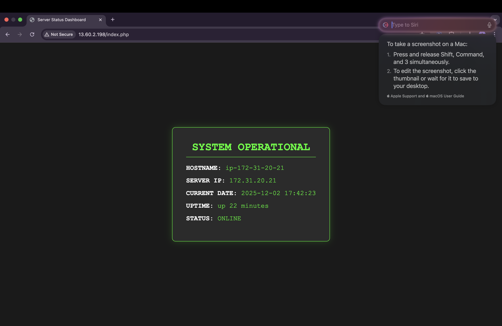

## 📖 Project Overview
## 📸 Server Dashboard Preview
*(This is the custom dashboard running live on the AWS server)*




---

## 🛠️ Tech Stack & Skills
| Component | Technology Used | Skill Demonstrated |
| :--- | :--- | :--- |
| **Cloud Provider** | AWS EC2 (T3.micro) | VPC, Security Groups, Instance Management |
| **OS** | Ubuntu | Package Management (`apt`), User Permissions (`chown`) |
| **Web Server** | Nginx | Reverse Proxy Config, Server Blocks |
| **Backend** | PHP 8.3 (FPM) | FastCGI Configuration, Unix Sockets |
| **Automation** | Bash Scripting | Infrastructure provisioning |

---

## 🔧 Challenges Faced & Solutions

### 1. Nginx PHP Processing (The "Download" Error)
* **Challenge:** By default, Nginx does not know how to handle `.php` files and simply downloads them to the client.
* **Solution:** I manually configured the Nginx server block (`/etc/nginx/sites-available/default`) to route PHP traffic to the `php8.3-fpm` socket.
    ```nginx
    location ~ \.php$ {
        include snippets/fastcgi-php.conf;
        fastcgi_pass unix:/run/php/php8.3-fpm.sock;
    }
    ```

### 2. System Command Execution
* **Challenge:** The web dashboard needed to display the server's "Uptime," which is an OS-level metric, not a web metric.
* **Solution:** I utilized the PHP `shell_exec('uptime -p')` function to bridge the gap between the Application Layer and the OS Layer, safely displaying the output in the browser.

---

## 🚀 How to Replicate This Server

You can set up this exact infrastructure by running the included automation script.

1.  **Launch an AWS EC2 Instance** (Ubuntu 24.04).
2.  **Configure Security Group:** Allow ports `22` (SSH) and `80` (HTTP).
3.  **SSH into the server** and clone this repo (or copy the script).
4.  **Run the installation script:**
    ```bash
    sudo chmod +x install_lemp.sh
    ./install_lemp.sh
    ```
5.  **View the Dashboard:** Navigate to `http://<YOUR_SERVER_IP>/`

---

## 📂 Repository Structure
* `install_lemp.sh` - Bash script that automates the `apt install` and Nginx configuration process.
* `index.php` - Source code for the Server Health Dashboard.
* `dashboard-proof.png` - Verification screenshot of the live deployment.

---

### 👤 Author
**[Parth Ukandrao Dabhade]**
*Aspiring Cloud Engineer & System Administrator*
